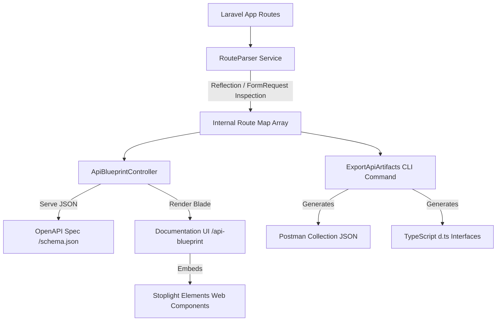

# Package Architecture

This document describes the architectural layout, core modules, and data flow of the **Laravel API Blueprint** package.

## 1. System Overview

Laravel API Blueprint is a lightweight, zero-dependency Laravel package that automatically documents API routes. It uses native PHP reflection to inspect controller parameters, resolves `FormRequest` validation rules, and generates OpenAPI specs, TypeScript interfaces, and Postman collections.

## 2. Core Modules

### 2.1 Services & Engine
- **`RouteParser`**: Uses Reflection on controller methods to locate dependencies sub-classed from `FormRequest`. Instantiates requests dynamically to fetch rules arrays, converting rules (e.g., `required|integer`) into OpenAPI properties.
- **`PostmanGenerator`**: Loops through the internal route map array to compile a valid Postman Collection (v2.1.0) JSON file, auto-populating request bodies for POST/PUT/PATCH routes.
- **`TypeScriptGenerator`**: Evaluates validation rules for each route, translating Laravel types (e.g., `string`, `integer`, `boolean`, `array`) into their TypeScript equivalents (`string`, `number`, `boolean`, `any[]`) and outputting standard TypeScript `interface` declarations.

### 2.2 HTTP Interface
- **`ApiBlueprintController`**: Exposes the main `/api-blueprint` path to render the HTML documentation viewer and `/api-blueprint/schema.json` to stream the dynamically generated OpenAPI specification.
- **`GatedDocAccess`**: Basic HTTP authentication middleware that checks configured username/password credentials before permitting access to endpoints.

### 2.3 CLI Integration
- **`ExportApiArtifacts`**: A console command (`php artisan blueprint:export`) that triggers compilation of Postman collections and TypeScript interfaces, saving them directly to specified paths on disk.

## 3. Data Flow

1. **Bootstrap Phase**: `ApiBlueprintServiceProvider` merges default configuration and registers CLI commands, Blade views, and endpoints under the configured prefix.
2. **Dynamic Generation**: When `/api-blueprint/schema.json` is requested:
   - `RouteParser` queries `Route::getRoutes()`.
   - It filters for routes starting with `api/`.
   - It inspects methods for `FormRequest` parameters.
   - It resolves the validation rules, maps them to types, and builds the OpenAPI 3.1.0 spec structure.
3. **Artifact Compilation**: When `blueprint:export` runs:
   - The CLI handles execution.
   - It parses all API routes.
   - It outputs Postman and TypeScript artifacts to paths defined under the `outputs` config keys.
