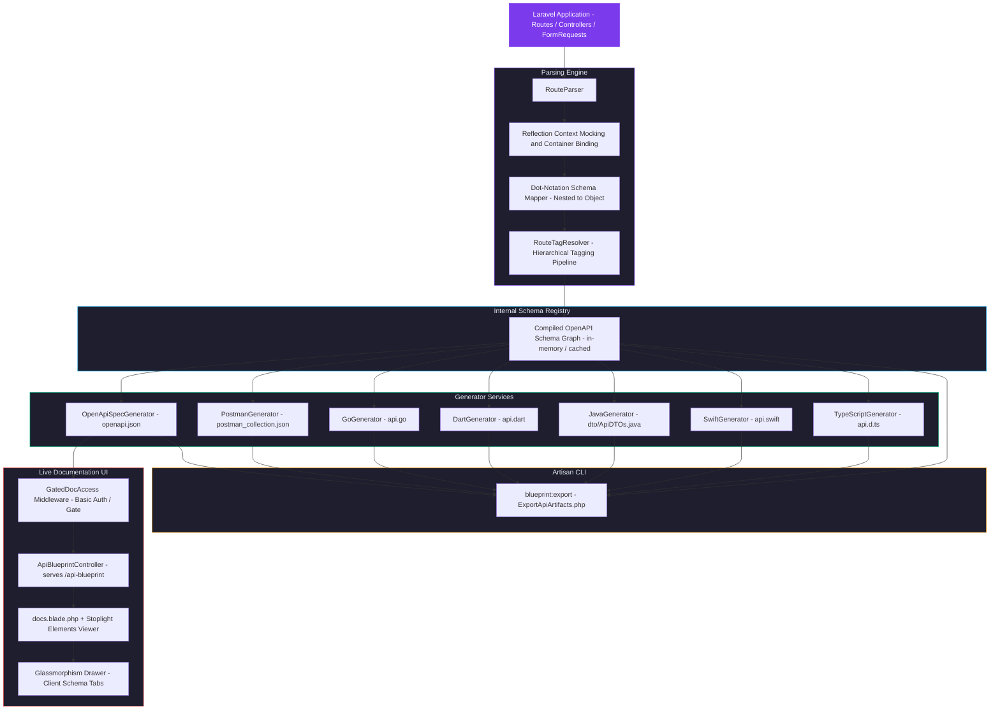

<p align="center">
  
</p>

# Laravel API Blueprint

[](https://packagist.org/packages/clcbws/laravel-api-blueprint)
[](https://packagist.org/packages/clcbws/laravel-api-blueprint)
[](LICENSE.md)

**Laravel API Blueprint** (`clcbws/laravel-api-blueprint`) is a zero-dependency, ultra-lightweight, and highly robust documentation and code-generation engine designed for modern Laravel APIs. It automatically parses active API routes, safely extracts payload validation schemas directly from custom `FormRequest` injects using native PHP reflection, compiles full OpenAPI specifications and Postman Collections, and dynamically generates typed data structures for **5 major programming languages**.

---

## 🌟 Core Features & Highlights

### 1. Zero Bloat & Zero External Dependencies
Avoid heavy annotation parsers or bloated third-party libraries. Laravel API Blueprint relies entirely on PHP's native reflection capabilities and built-in Laravel utilities, keeping your vendor footprints completely clean.

### 2. High-Fidelity AST-Free Parsing & Inline Validation Scanner
Enables fully dynamic documentation without static AST dependencies. If a controller action doesn't use a dedicated `FormRequest` class, the engine fallback scans the controller method's source code at runtime using a high-precision regex scanner to isolate `$request->validate([...])` or `Validator::make(...)` arrays and extract their rules.

### 3. Balanced Bracket-Counting JSON Response Extractor
Automatically reads the controller action's raw code body to discover returned JSON responses (e.g. `response()->json([ 'token' => ... ])`). Utilizing a 100% robust bracket-counting algorithm, it isolates only top-level returned keys (`token`, `user`, `message`, `data`, etc.) and automatically documents them in the OpenAPI `responses` schema, solving the gap where return payloads were undocumented.

### 4. GET/DELETE Query Parameter Flat-Mapping
GET and DELETE request validation schemas are dynamically flattened using dot-notation (e.g. `filter[status]`) and mapped directly into query parameter blocks (`in: query`), preventing invalid `requestBody` blocks in OpenAPI specs.

### 5. Validation Auto-Confirmation & Advanced Constraints
- Automatically injects matching validation inputs (like `password_confirmation` for `password`) if a rule contains the `confirmed` validation rule.
- Maps `nullable` constraints (`'nullable' => true` in OpenAPI 3.1.0) and `in:val1,val2` rules into standard `'enum'` constraints.
- Formats standard constraints like `email`, `url`, `uuid`, `date`, `password`, `min`, and `max` automatically.

### 6. PHPDoc Comment Parsing & Path Variable Extraction
Leverages PHP `ReflectionMethod::getDocComment()` to parse dynamic controller method summaries, descriptions, and custom `@response` codes. It also scans route URIs to detect, extract, and document parameter identifiers (such as `{id}`) as variables.

### 7. Automatic Security Inference & Token Authentication
Inspects route middlewares for authentication tags (e.g. `auth` or `AuthenticateApiToken`). When authentication is required, it injects the security requirements (`"security": [{"bearerAuth": []}]`) onto the route, triggering Stoplight Elements' Bearer Token authentication UI automatically.

### 8. Multi-Layered Route Grouping & Tag Resolution
Integrates a dedicated tag resolution pipeline (`RouteTagResolver`) supporting:
1. **Glob-based manual mapping configurations** in your package config.
2. **PHP 8 native attributes** (`#[Group]`) on methods or classes (method attributes override class attributes).
3. **PHPDoc annotations** (`@group` or `@tags`).
4. **Intelligent Fallbacks** like class-name parsing (e.g. `EmployeeController` -> `Employees`) and URI-segment parsing.

### 9. Collapsible Sidebar Version Folders & x-tagGroups
Versioned URI segments (like `/v1/` or `/v2/`) are automatically identified. The OpenAPI compiler generates the root-level `x-tagGroups` extension, causing Stoplight Elements to natively render fully collapsible, nested parent folders (e.g., `V1` and `V2` folders) in its sidebar tree view instead of a flat list.

### 10. Interactive Version Selector Dropdown & Live Reloading
A premium, visually polished Version Selector dropdown is rendered in the header dashboard, defaulting to the latest version. When a version is changed, the browser uses DOM replacement to instantly re-initialize Stoplight Elements and fetch version-filtered specifications (`?version=v2`) smoothly without a full page refresh.

### 11. Custom Markdown Documentation Overview Pages
Enables loading custom documentation guides specified dynamically via the `'overview_path'` configuration key. If the path does not exist, the engine displays a pre-loaded, premium default integration and authentication manual.

### 12. Postman Collection Folder-Grouping & Streaming Exports
- Compiles fully compliant **Postman v2.1.0 Collections**.
- Requests are organized into hierarchical sub-folders matching their resolved API tags automatically.
- Serves dynamic collections directly via `/postman.json` route endpoint, fully downloadable with a single click from the Postman button.

### 13. Interactive In-Browser Exporters (The Glassmorphism Drawer)
Inside the interactive documentation web UI, users can slide out a glowing Glassmorphism control panel with live tabs to instantly view and copy generated payload schemas in **5 client-side languages**:
1.  **TypeScript**: Nested type-safe `interface` models.
2.  **Swift**: Nested iOS `Codable` structs.
3.  **Java**: Immutable, modern Java 14+ `record` schemas with Jackson annotations.
4.  **Dart**: Flutter-compatible models complete with factory `fromJson` and standard `toJson` serialization/deserialization utilities.
5.  **Go**: Idiomatic Go struct definitions featuring standard `json:"...,omitempty"` structure tags.

### 14. Sub-Millisecond Serialization Caching
In production environments, scanning classes and running reflection on every page view degrades performance. The package features a lightweight file serialization caching engine that saves compiled OpenAPI JSON schemas directly to the server's cache, ensuring sub-millisecond route execution speeds.

---

## 📦 Installation

Add the package to your Laravel application via Composer (ideally in your development scope):

```bash
composer require clcbws/laravel-api-blueprint --dev
```

Once installed, publish the configuration blueprint:

```bash
php artisan vendor:publish --provider="LaravelApiBlueprint\Providers\ApiBlueprintServiceProvider" --tag="api-blueprint-config"
```

---

## ⚙️ Configuration Options

The default configuration file is published at `config/api-blueprint.php`. Below is a comprehensive breakdown of each configuration key:

```php
return [
    /*
    |--------------------------------------------------------------------------
    | Global Enable/Disable Toggle
    |--------------------------------------------------------------------------
    | Set to false to disable documentation endpoints and commands completely.
    */
    'enabled' => env('API_BLUEPRINT_ENABLED', true),

    /*
    |--------------------------------------------------------------------------
    | Routing Dashboard Path
    |--------------------------------------------------------------------------
    | The base URI where your documentation will be served (e.g., http://your-app.test/api-blueprint).
    */
    'path' => env('API_BLUEPRINT_PATH', 'api-blueprint'),

    /*
    |--------------------------------------------------------------------------
    | Route Middleware Stack
    |--------------------------------------------------------------------------
    | Middleware applied to the docs viewer and schema routes. Custom middleware
    | or authentication guards can be added here.
    */
    'middleware' => [
        LaravelApiBlueprint\Http\Middleware\GatedDocAccess::class,
    ],

    /*
    |--------------------------------------------------------------------------
    | Gated Access Security Control
    |--------------------------------------------------------------------------
    | You can secure your endpoints using standard HTTP basic auth credentials,
    | or define a custom Laravel authorization Gate (e.g., 'view-api-docs')
    | for session and role-based checks.
    */
    'auth' => [
        'username' => env('API_BLUEPRINT_USERNAME', 'admin'),
        'password' => env('API_BLUEPRINT_PASSWORD', 'secret'),
        
        // Example: Gate::allows('view-api-docs')
        'gate' => null, 
    ],

    /*
    |--------------------------------------------------------------------------
    | Route Inspection Filters
    |--------------------------------------------------------------------------
    | Define the prefix scopes. Only routes matching these prefix filters will
    | be parsed and compiled by the documentation engine.
    */
    'route_prefixes' => ['api/'],

    /*
    |--------------------------------------------------------------------------
    | High-Performance Spec Caching
    |--------------------------------------------------------------------------
    | Set to true to cache the compiled specification file on disk, avoiding
    | parsing controller files on every web view.
    */
    'cache_enabled' => env('API_BLUEPRINT_CACHE', true),

    /*
    |--------------------------------------------------------------------------
    | Structural Exporter Target Outputs
    |--------------------------------------------------------------------------
    | Path locations where Postman collection and programming language schemas
    | will be compiled and dumped when running the export command.
    */
    'outputs' => [
        'postman_path'    => storage_path('app/api-blueprint/postman_collection.json'),
        'typescript_path' => storage_path('app/api-blueprint/api.d.ts'),
        'swift_path'      => storage_path('app/api-blueprint/api.swift'),
        'java_path'       => storage_path('app/api-blueprint/dto'),
        'dart_path'       => storage_path('app/api-blueprint/api.dart'),
        'go_path'         => storage_path('app/api-blueprint/api.go'),
    ],

    /*
    |--------------------------------------------------------------------------
    | Route Grouping / Tagging Mappings
    |--------------------------------------------------------------------------
    | Define custom tags/groups for specific URI patterns or controller names.
    | Matches can use wildcards (e.g. 'api/v1/auth/*' or 'App\Http\Controllers\Admin\*').
    */
    'groups' => [
        // 'api/v1/auth/*' => 'Authentication',
    ],

    /*
    |--------------------------------------------------------------------------
    | API Documentation Overview
    |--------------------------------------------------------------------------
    | Path to a Markdown file containing the custom overview/guide documentation.
    | If not specified or if the file does not exist, a default elegant guide is shown.
    */
    'overview_path' => resource_path('api-blueprint/overview.md'),

    /*
    |--------------------------------------------------------------------------
    | API Version
    |--------------------------------------------------------------------------
    | The current version of your API endpoints.
    | This is mapped to the OpenAPI and Postman schemas automatically.
    */
    'version' => env('API_BLUEPRINT_VERSION', '1.0.0'),
];
```

---

## 🚀 How to Use

### 1. View Interactive Documentation Dashboard
Navigate directly to your configured path (e.g., `http://your-app.test/api-blueprint`).
1. **Interactive Visualizer**: Elements dashboard lets you explore active HTTP request methods, headers, parameters, and payloads.
2. **Glassmorphism Exporter Drawer**: Click the glowing **Client Schemas** button in the header. A blurred overlay slides open from the right, allowing you to select and copy perfectly formatted payload schemas for **TypeScript, Swift, Java, Dart, and Go** computed on the fly.
3. **Theme Switcher**: Instantly toggle between a custom dark/light premium aesthetic (persisted in local storage).
4. **Version Selector Dropdown**: Renders available versions dynamically, defaulting to the latest version. Changing the value automatically filters the visible routes and updates the Postman collection download link instantly.

### 2. Export Client Schemas and Artifacts via CLI
You can compile the entire set of Postman collections, OpenAPI specs, and the 5 language models directly into your storage outputs by running:

```bash
php artisan blueprint:export
```

On success, the console logs the output directories:
```text
Parsing runtime route structures...
Postman Collection dumped to: storage/app/api-blueprint/postman_collection.json
TypeScript Interfaces dumped to: storage/app/api-blueprint/api.d.ts
Swift Codable Structs dumped to: storage/app/api-blueprint/api.swift
Java DTO Records dumped to: storage/app/api-blueprint/dto/ApiDTOs.java
Dart Serialization Models dumped to: storage/app/api-blueprint/api.dart
Go Structs dumped to: storage/app/api-blueprint/api.go
All API schema artifacts successfully compiled and exported.
```

---

## 📁 Package Architecture & Directory Structure

```text
src/
├── Attributes/
│   └── Group.php                              # Native PHP 8 documentation tagging Attribute class
├── Providers/
│   └── ApiBlueprintServiceProvider.php        # Bootstraps package configs, views, commands, and routes
├── Http/
│   ├── Controllers/
│   │   └── ApiBlueprintController.php         # Serves UI view, schema JSON, and Postman downloads
│   └── Middleware/
│       └── GatedDocAccess.php                 # Enforces security credentials using basic auth or custom Gates
├── Services/
│   ├── BaseSchemaGenerator.php                # Base class defining identifier cleaning and name sanitizing
│   ├── RouteParser.php                        # Reflects controller methods, resolves requests, maps dot-notation
│   ├── RouteTagResolver.php                   # Resolves hierarchical documentation tagging
│   ├── OpenApiSpecGenerator.php               # Compiles compliant OpenAPI 3.1.0 specification files
│   ├── PostmanGenerator.php                   # Formulates Postman collections with subfolder grouping support
│   ├── TypeScriptGenerator.php                # Formats typescript interfaces
│   ├── SwiftGenerator.php                     # Formats Swift Codable models
│   ├── JavaGenerator.php                      # Formats Java 14+ Record structures
│   ├── DartGenerator.php                      # Formats Dart Flutter serializable classes
│   └── GoGenerator.php                        # Formats json-tagged Go struct schemas
└── Commands/
    └── ExportApiArtifacts.php                 # Artisan CLI exporter command execution
```

### 🗺️ Data-Flow Architecture



---

## 🧪 Automated Testing

Laravel API Blueprint is fully covered by an automated test suite verifying:
- Safe container instantiation of custom `FormRequest` elements.
- Multi-dimensional translation of dot-notation rule structures.
- Structural layout outputs for **TypeScript, Swift, Java, Dart, and Go**.
- Compilation accuracy of Postman Collections and OpenAPI specs.

Verify the test suite locally in your environment:

```bash
vendor/bin/phpunit tests/Feature/ApiBlueprintTest.php
```

Output:
```text
PHPUnit 11.5.55 by Sebastian Bergmann and contributors.

Runtime:       PHP 8.5.6
.
..
...
....
.....
......
.......
........
.........
..........
...........                                                       11 / 11 (100%)

Time: 00:00.322, Memory: 26.00 MB
OK (11 tests, 130 assertions)
```

---

## 📄 License

This package is licensed under the MIT License. See [LICENSE.md](LICENSE.md) for details.
